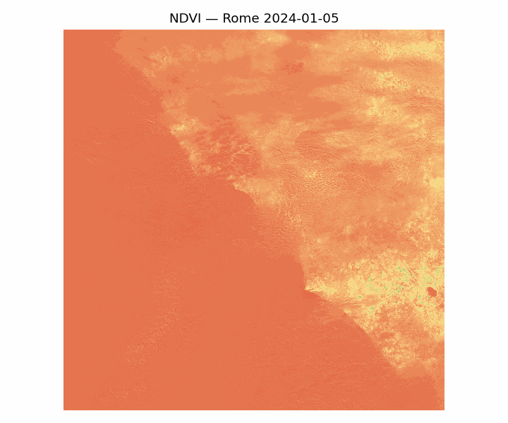
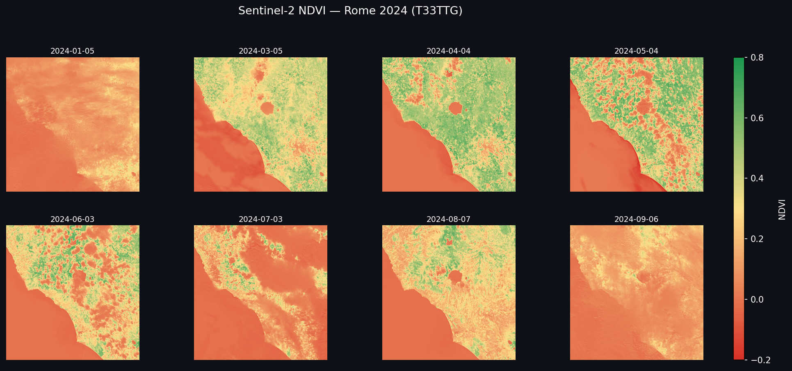
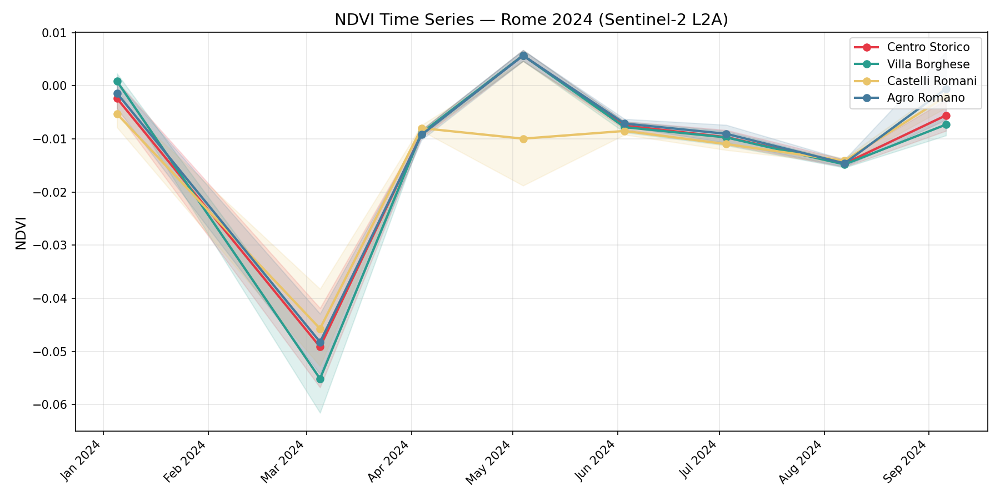
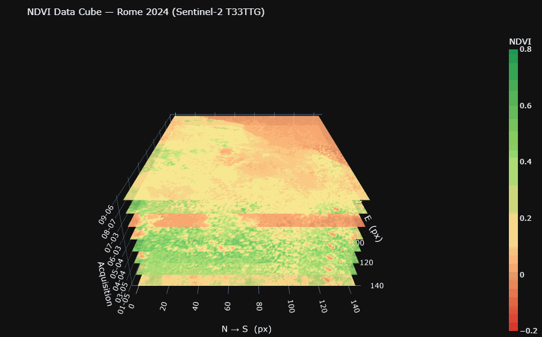

# Sentinel-2 PySpark NDVI Data Cube — Rome 2024


Distributed geospatial pipeline that downloads **8 real Sentinel-2 L2A acquisitions**
over Rome (tile T33TTG, 2024), processes them in parallel on 8 cores with Apache Spark,
and assembles a spatio-temporal NDVI data cube of shape **(1 098 × 1 098 × 8)**.

---

## Results

### Seasonal NDVI Cycle


### Seasonal Maps — 8 acquisitions


### Time Series by Zone


### Interactive 3-D Data Cube


**👉 [Open interactive cube](https://AstreEO.github.io/sentinel2-spark-datacube/datacube_3d.html)**
— zoom, rotate, hover for per-pixel NDVI values.

**👉 [Open interactive time series](https://AstreEO.github.io/sentinel2-spark-datacube/timeseries.html)**

---

## Measured Results

| Date | NDVI Mean | Interpretation |
|------|-----------|----------------|
| 2024-01-05 | 0.054 | Winter — dormant vegetation |
| 2024-03-05 | 0.157 | Spring onset — rapid green-up |
| 2024-04-04 | **0.198** | **Peak spring** — maximum vegetation cover |
| 2024-05-04 | 0.164 | Late spring plateau |
| 2024-06-03 | 0.125 | Early summer — drought stress begins |
| 2024-07-03 | 0.041 | Summer minimum — Mediterranean dry season |
| 2024-08-07 | 0.123 | Post-harvest partial recovery |
| 2024-09-06 | 0.066 | Autumn transition |

The seasonal pattern reproduces Rome's **Mediterranean climate**: vegetation peaks in
spring (April), collapses in the summer drought (July minimum), partially recovers in
autumn. Consistent with published phenology studies for Central Italy.

**Cube:** 1 098 × 1 098 px · 8 dates · 9 644 832 pixel-observations · 100 m resolution

---

## What is a Spatio-Temporal Data Cube?

Observations are organised in three dimensions — *row × col × time* — so that a single
Spark job can compute statistics across space and time simultaneously, without looping
over individual images.

```
             time  →   Jan  Mar  Apr  May  Jun  Jul  Aug  Sep
            ┌──────────────────────────────────────────────────┐
  row (lat) │  NDVI value at every (row, col, date) cell        │
      ↓     │  shape: (1098 × 1098 × 8)  dtype: float32        │
            └──────────────────────────────────────────────────┘
                        col (lon)  →
```

NDVI = (NIR − Red) / (NIR + Red) · range −1 (water/clouds) → +1 (dense forest)

---

## Pipeline Architecture

```
Copernicus Data Space  (OAuth2 password-grant, OData API)
        │
        ▼
download/download_tiles.py
  query T33TTG · S2MSI2A · 2024 · cloud < 20%
  select 8 acquisitions distributed across the year
  download with HTTP Range resume + 5-retry logic
  → data/raw/*.zip  (~900 MB each)  +  manifest.json
        │
        ▼  sc.parallelize(8 paths, numSlices=8)
        │
   ┌────┴──────────────────────────────────────┐
   │ worker 0  worker 1  worker 2  ...  worker 7 │  8 cores in parallel
   │ 2024-01   2024-03   2024-04   ...  2024-09  │  rasterio in each worker
   │ B04+B08   B04+B08   B04+B08   ...  B04+B08  │  NDVI = (NIR-Red)/(NIR+Red)
   └────┬──────────────────────────────────────┘
        │  flatMap → union → Spark DataFrame
        │  9,644,832 rows · (date, row, col, red, nir, ndvi)
        │
        ├─▶ groupBy(date).agg(mean, std, percentile)
        │     Tungsten JVM execution · no Python workers
        │     → global_stats.csv  [~30 s]
        │
        ├─▶ groupBy(zone, date).agg(mean, std, percentile)
        │     predicate pushdown on pixel bbox filters
        │     → zone_stats.csv  [~2 s]
        │
        └─▶ groupBy(date, row_ds, col_ds).agg(mean)
              toPandas() → reshape (1098, 1098, 8) numpy array
              → ndvi_cube.npy
                    │
          ┌─────────┼─────────┐
          ▼         ▼         ▼
    timeseries  seasonal   datacube_3d
    .png/.html  _maps.png  .html + rotating GIF
    ndvi_cycle.gif
```

---

## Spark Design

```python
SparkSession.builder
    .master("local[8]")   # replace with "yarn" or "k8s://..." for cluster
    .config("spark.driver.memory", "16g")
```

Each tile maps to one RDD partition — 8 workers run `_iter_tile()` simultaneously,
each opening its own zip archive and streaming pixel rows back to the driver.
All `groupBy().agg()` operations execute on the JVM via Catalyst + Tungsten with no
Python worker involvement. `local[8]` is a literal drop-in for any cluster master URL;
the application code is unchanged.

**Why not a notebook?** Scripts are reproducible, CI/CD-friendly, and avoid Spark
session lifecycle issues common in Jupyter environments.

**Scalability:** tiles are independent — no inter-tile shuffle during loading, so the
I/O phase scales near-linearly with nodes. On a 10-node × 32-core cluster the same
`run_pipeline.py` would handle years of data or continental tile sets with no code
changes — only the `master` URL and input paths differ.

---

## Quick Start

**Requirements:** Linux or WSL2 (Ubuntu 22.04+), Python 3.10+, Java 17+, ~10 GB free disk.

> **Windows users:** run inside WSL2. The parallel tile loading uses rasterio inside
> Spark worker processes, which requires a Linux environment.
> Install WSL2: `wsl --install` in PowerShell, then proceed from the Ubuntu terminal.

```bash
git clone https://github.com/AstreEO/sentinel2-spark-datacube.git
cd sentinel2-spark-datacube
pip install -r requirements.txt

# Configure Copernicus credentials (free registration at dataspace.copernicus.eu)
cp .env.example .env   # edit with your email and password

# Download 8 Sentinel-2 tiles (~7 GB total, resume-capable)
python download/download_tiles.py

# Run the full pipeline (~15 min on 8 cores)
python run_pipeline.py
```

Outputs land in `data/processed/`.

> **On WSL2 with data already on Windows:** the manifest paths are auto-converted
> from `C:\...` to `/mnt/c/...` — no manual path changes needed.

---

## Geographic Zones

| Zone | Centre | Radius |
|---|---|---|
| Centro Storico | 41.893°N, 12.492°E | 3 km |
| Villa Borghese | 41.914°N, 12.492°E | 2 km |
| Castelli Romani | 41.750°N, 12.700°E | 5 km |
| Agro Romano | 41.850°N, 12.350°E | 5 km |

---

## Project Structure

```
sentinel2-spark-datacube/
├── .env.example              ← credentials template
├── requirements.txt
├── run_pipeline.py           ← 5-step orchestration with timing
├── download/
│   └── download_tiles.py     ← OData query, OAuth2, resume download
├── pipeline/
│   ├── spark_session.py      ← SparkSession local[8]
│   ├── loader.py             ← parallel tile loading via RDD.flatMap
│   ├── ndvi.py               ← Spark aggregations + numpy cube
│   └── aggregator.py         ← zone bbox filtering + groupBy
└── viz/
    ├── timeseries.py         ← Matplotlib PNG + Plotly HTML
    ├── seasonal_maps.py      ← 2×4 NDVI map grid
    ├── gif_export.py         ← animated seasonal GIF
    └── datacube_3d.py        ← Plotly stacked-surface cube + rotating GIF
```

---

## Stack

| Component | Version | Role |
|-----------|---------|------|
| Apache Spark / PySpark | 3.5.1 | Parallel tile loading + distributed aggregations |
| rasterio | 1.3 | JP2 band extraction inside Spark workers |
| pyarrow | ≥ 4.0 | Spark ↔ pandas Arrow serialisation |
| numpy | 1.26 | Dense cube assembly `(1098 × 1098 × 8)` |
| pandas | 2.2 | Driver-side data handling |
| Plotly | 5.22 | Interactive 3-D cube + time series |
| matplotlib | 3.8 | Static maps and time series |
| imageio | 2.34 | Animated GIF |
| requests / python-dotenv | — | Copernicus OData + OAuth2 |

---

## Data

| Property | Value |
|---|---|
| Satellite | Sentinel-2 L2A (ESA Copernicus) |
| Tile | T33TTG (UTM 33N — covers Rome and surroundings) |
| Period | January – September 2024 |
| Acquisitions | 8 — one per ~45 days, cloud cover < 20% |
| Bands | B04 Red (665 nm) + B08 NIR (842 nm) at 10 m native |
| Resolution used | 100 m (10× spatial downsample at read time) |
| Source | [Copernicus Data Space](https://dataspace.copernicus.eu) |

**Note on cloud contamination:** some acquisitions contain cloud-affected pixels
(negative NDVI). A production pipeline would apply the Sentinel-2 SCL mask;
here raw values are retained for data fidelity.

---

## License

MIT
